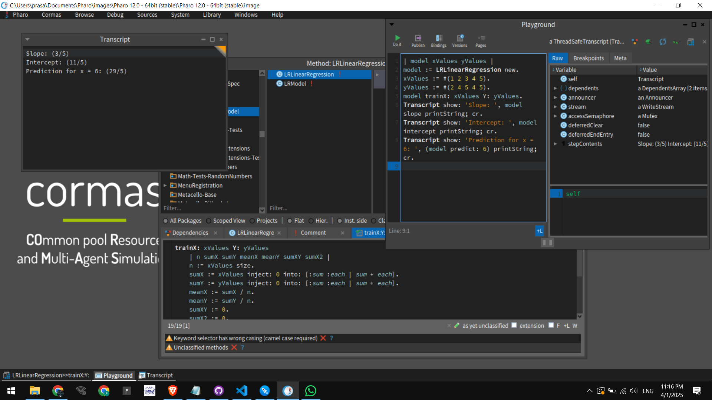

# Pharo Linear Regression

## 📷 Screenshot


## Overview
This project implements **Linear Regression** in **Pharo** using **Cormos**. The implementation provides a simple way to train a linear model on a given dataset and make predictions.

## Features
- Loads and processes input data
- Computes the best-fit linear regression model
- Predicts values based on the trained model
- Outputs results in a structured format

## Requirements
To run this project, you need:
- **Pharo** installed on your system ([Download Pharo](https://pharo.org/download))
- **Cormos** loaded into your Pharo environment

## Installation & Setup
### 1. Clone the Repository
```bash
git clone https://github.com/YourUserName/Pharo-LinearRegression.git
cd Pharo-LinearRegression
```

### 2. Load the `.st` file into Pharo
1. Open Pharo
2. Go to **World Menu** → **File Browser**
3. Locate and select `LinearRegression.st`
4. Click **File In** to load the project

## Usage
1. Open Pharo's Playground or Workspace.
2. Run the following command to initialize and train the model:
   ```smalltalk
   LinearRegression new train.
   ```
3. To make predictions:
   ```smalltalk
   LinearRegression new predict: 5.
   ```

## File Structure
```
Pharo-LinearRegression/
├── LinearRegression.st   # Pharo Smalltalk source code
├── README.md             # Project documentation
└── .gitignore            # Git ignore file
```


